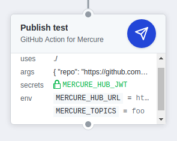

# 🚀 GitHub Action for Mercure

[](https://github-actions.netlify.com/action-mercure)
[](https://actions-badge.atrox.dev/Ilshidur/action-mercure/goto)

Send a [Mercure](https://mercure.rocks) publish event. Simple as that.



## Compatibility note

As this Action is containerized with Docker, [it can only run on Linux environments](https://help.github.com/en/actions/building-actions/about-actions#types-of-actions).

> Docker container actions can only execute in the GitHub-hosted Linux environment.

> Self-hosted runners must use a Linux operating system and have Docker installed to run Docker container actions. For more information about the requirements of self-hosted runners, see "About self-hosted runners."

<hr/>

## Demo

1) Go to https://demo.mercure.rocks, in the **Subscribe** section.
2) Subscribe for notifications on this *topic* : **`foo`**.
3) 🌟 Star 🌟 this repo !
4) Quickly switch to the Mercure demo page to see a notification in your browser.

## Usage

 ```yaml
- name: Publish notification
  env:
    MERCURE_HUB_URL: ${{ secrets.MERCURE_HUB_URL }}
    MERCURE_HUB_JWT: ${{ secrets.MERCURE_HUB_JWT }}
    MERCURE_TOPICS: topic1,topic2
    MERCURE_TYPE: message
    MERCURE_PRIVATE: on
  uses: Ilshidur/action-mercure@master
  with:
    args: '{ \"hello\": \"world\" }'
```

**NOTICE :** for stability purposes, it is recommended to use the action with an explicit commit SHA-1 :

`uses = "Ilshidur/action-mercure@c80298a8875d00ecc2d1e4cf07e205866251628c"` (=> link to the commits list : https://github.com/Ilshidur/action-mercure/commits/master)

### Arguments

The argument is the content of the event to send. It is **RECOMMENDED** to use JSON.

**Environment variables can be interpolated** in the message using brackets (`{{` and `}}`) :

e.g.: `args: "{ \"action\": \"{{ GITHUB_ACTION }}\" }"`

### Environment variables

* **`MERCURE_TOPICS`**: the Mercure topics. **Supports interpolation** using (`{{` and `}}`).

### Secrets

* **`MERCURE_HUB_URL`** **(required)** : the **public** Mercure hub URL.
* **`MERCURE_HUB_JWT`** **(required)** : the publisher JWT. Keep it safe !
* **`MERCURE_TYPE`** *(optional)* : The message type to send. Defaults to `"message"`.
* **`MERCURE_PRIVATE`** *(optional)* : Set this variable with whatever value to make the notification private. The recommended way is to set it to `"on"`.
* That's all.

## Debugging / testing / development

Developers, all you need is in the [DEVELOPMENT.md](DEVELOPMENT.md) file.

## License

GNU GENERAL PUBLIC LICENSE v3.

<hr/>

<p align="center">
  Don't forget to 🌟 Star 🌟 the repo if you like this GitHub Action !<br/>
  <a href="https://github.com/Ilshidur/action-mercure/issues/new">Your feedback is appreciated</a>
</p>
